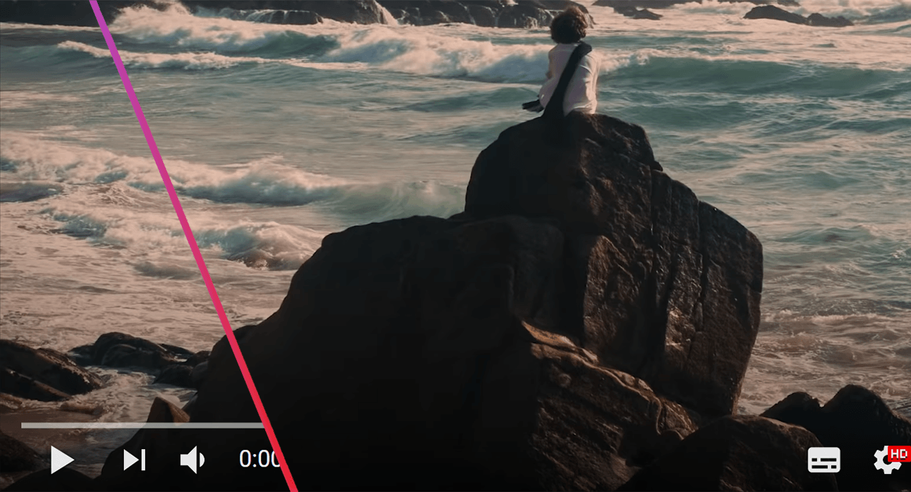

# YouTube Progress Bar Hider

Extension to hide the YouTube progress bar and video duration.
- Show or hide the progress bar by clicking on the extension
- Minimal permissions
- Lightweight (<15 KB)

## Install

Everything works out of the box, no need to compile anything.\
The extension is available on the [Chrome Web Store](https://chromewebstore.google.com/detail/youtube-progress-bar-hide/oijcookiachipbcjfimdahgaacmmkpea).\
The extension is available for [Firefox](https://addons.mozilla.org/en-US/firefox/addon/youtube-progress-bar-hider/).\
It is also available as a [.zip file](https://github.com/lorenzolanglois/YouTube-Progress-Bar-Hider/releases).
